# Warung Gemoy — Aplikasi Katering Rumahan

Aplikasi mobile pemesanan katering rumahan berbasis Flutter + Supabase. Dibangun end-to-end mulai dari autentikasi pelanggan, pemesanan menu harian, pembayaran, tracking pesanan real-time, hingga dashboard admin lengkap.

---

## Fitur Utama

### Pelanggan
- **Registrasi & Login** via nomor HP (tanpa email)
- **Menu Harian** dengan jadwal mingguan, stok real-time, dan kategori
- **Keranjang & Checkout** — pilih pengiriman atau ambil sendiri, hitung ongkir otomatis via Google Distance Matrix API
- **Lokasi Pengiriman** — pilih via Google Maps atau paste link Google Maps
- **Pembayaran** — Transfer Bank, QRIS, atau COD; upload bukti bayar; timer auto-cancel 30 menit
- **Tracking Pesanan** — 5 tab status (Pembayaran, Diproses, Siap, Diterima, History)
- **Riwayat Status** — timeline lengkap setiap perubahan status pesanan
- **Konfirmasi Penerimaan** + Rating & Review wajib setelah pesanan selesai
- **Chat dengan Admin** — sistem chat per akun, bisa lampirkan kartu pesanan
- **Notifikasi Push** — FCM untuk setiap perubahan status pesanan
- **Broadcast** — terima pengumuman dari admin dengan notifikasi in-app
- **Simpan Lokasi** — kelola beberapa alamat pengiriman

### Admin
- **Dashboard** — statistik harian, pesanan masuk real-time, badge chat
- **Kelola Pesanan** — 6 tab status, search, update status, verifikasi pembayaran
- **Kelola Menu** — CRUD menu + foto, kategori, jadwal mingguan per tanggal
- **Laporan** — export Excel & PDF
- **Pengaturan Toko** — jam buka/tutup, rekening bank, QRIS, tarif ongkir
- **Kelola Akun Pelanggan** — nonaktifkan, reset password, hapus akun
- **Chat dengan Pelanggan** — balas pesan, tutup sesi chat
- **Audit Log** — riwayat seluruh aksi admin dengan info perangkat
- **Notifikasi Push** — terima notif saat ada pesanan baru, bukti bayar masuk, pesanan dibatalkan

---

## Tech Stack

| Layer | Teknologi |
|-------|-----------|
| Mobile | Flutter (Dart) — Android |
| Backend | Supabase (PostgreSQL, Auth, Storage, Realtime, Edge Functions) |
| Push Notification | Firebase Cloud Messaging (FCM v1 API) |
| Maps & Lokasi | Google Maps Flutter, Geolocator, Geocoding |
| Ongkir | Google Distance Matrix API |
| State Management | Provider |
| Export | excel, pdf, printing |
| Notifikasi Lokal | flutter_local_notifications |

---

## Arsitektur & Desain

- **Database:** PostgreSQL via Supabase — 18+ tabel dengan relasi FK, trigger, dan RPC functions
- **Realtime:** Supabase Realtime subscriptions untuk update pesanan, chat, stok menu, dan badge
- **Stok Atomik:** RPC `increment_used_qty` dengan `FOR UPDATE` row lock — mencegah race condition saat checkout bersamaan
- **Push Notification:** Edge Function Deno (TypeScript) + FCM v1 API dengan service account JWT
- **Cron Jobs:** 6 cron aktif — auto-konfirmasi pesanan, reminder pembayaran, auto-hapus data lama
- **Keamanan:** Credentials dipisah via `config.dart` (gitignored), keystore signing untuk release APK

---

## Struktur Project

```
lib/
├── config.example.dart      # Template credentials (salin jadi config.dart)
├── main.dart
├── models/
├── screens/
│   ├── auth/                # Login & Register
│   ├── home/                # Home & Broadcast
│   ├── order/               # Cart, Checkout, Payment, Tracking
│   ├── profile/             # Profil & Saved Locations
│   ├── chat/                # Chat pelanggan
│   └── admin/               # Seluruh halaman admin
└── services/                # CartProvider, FCM, Notification
```

---

## Cara Menjalankan

### Prasyarat
- Flutter SDK >= 3.11.1
- Android Studio / VS Code
- Akun Supabase (database & storage)
- Akun Firebase (push notification)
- Google Cloud API Key (Maps SDK + Distance Matrix API)

### Setup

1. Clone repo ini:
   ```bash
   git clone https://github.com/alifsastro2/warung-gemoy.git
   cd warung-gemoy
   ```

2. Salin file credentials:
   ```bash
   cp lib/config.example.dart lib/config.dart
   ```

3. Isi `lib/config.dart` dengan credentials kamu:
   ```dart
   class Config {
     static const supabaseUrl = 'https://YOUR_PROJECT.supabase.co';
     static const supabaseAnonKey = 'YOUR_ANON_KEY';
     static const googleMapsKey = 'YOUR_MAPS_KEY';
     static const googleDistanceMatrixKey = 'YOUR_DISTANCE_MATRIX_KEY';
   }
   ```

4. Tambahkan `google-services.json` dari Firebase Console ke `android/app/`

5. Install dependencies:
   ```bash
   flutter pub get
   ```

6. Jalankan:
   ```bash
   flutter run
   ```

---

## Screenshots

<p float="left">
  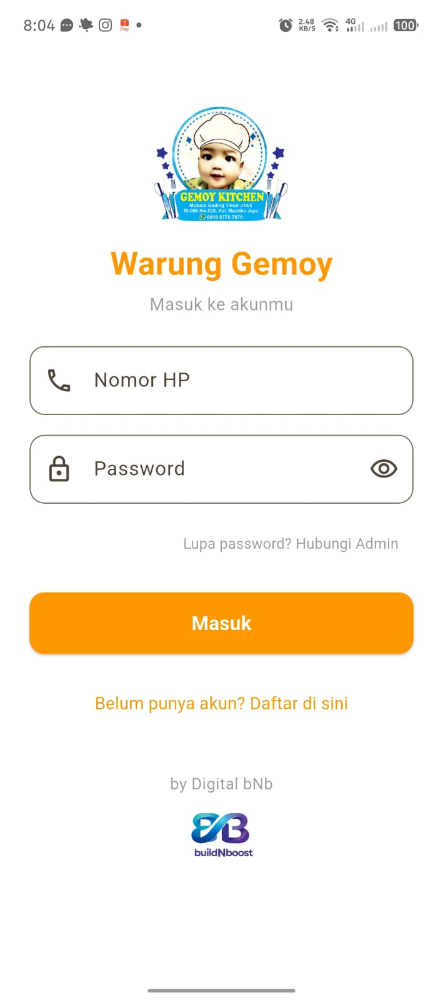
  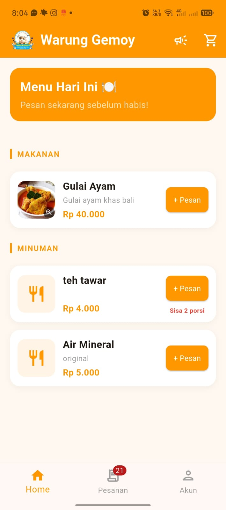
  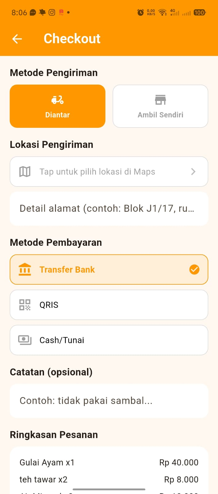
  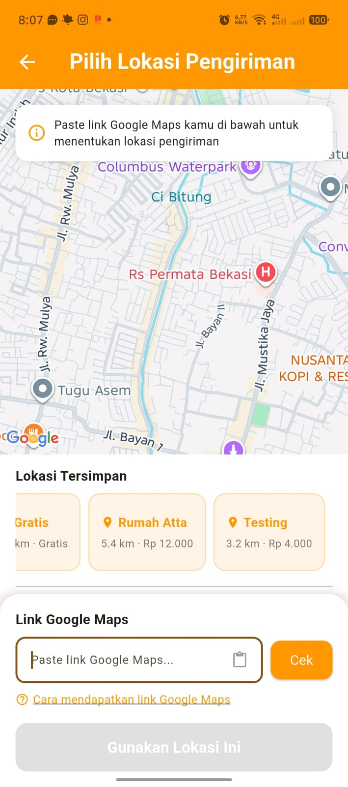
  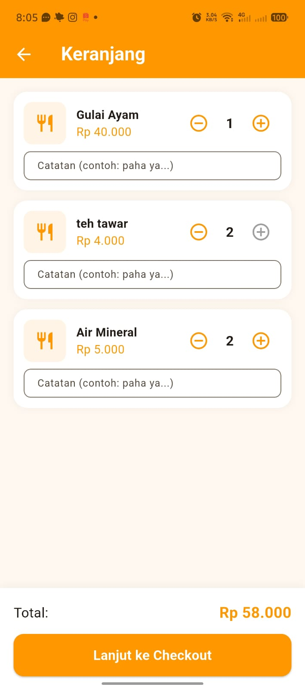
</p>
<p float="left">
  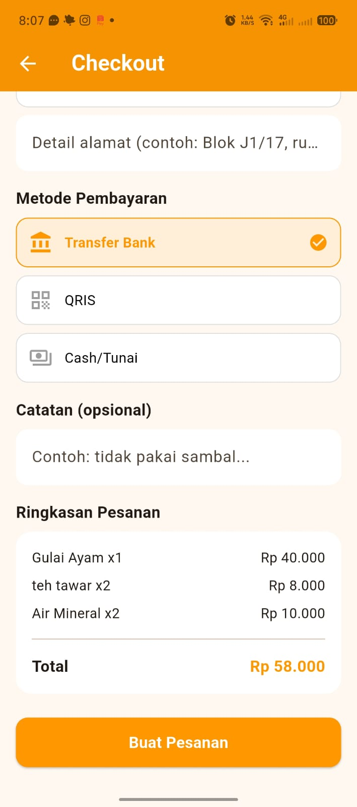
  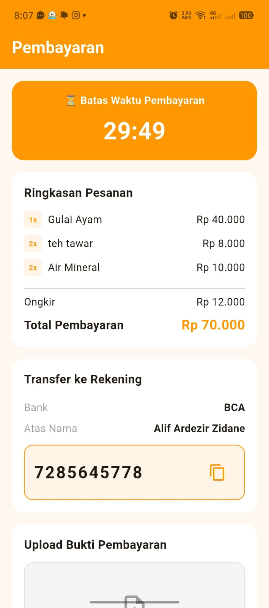
  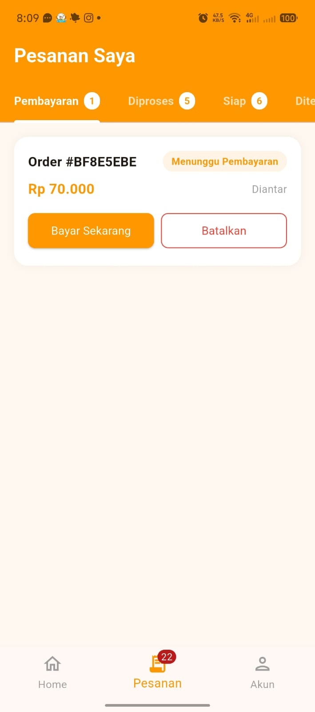
  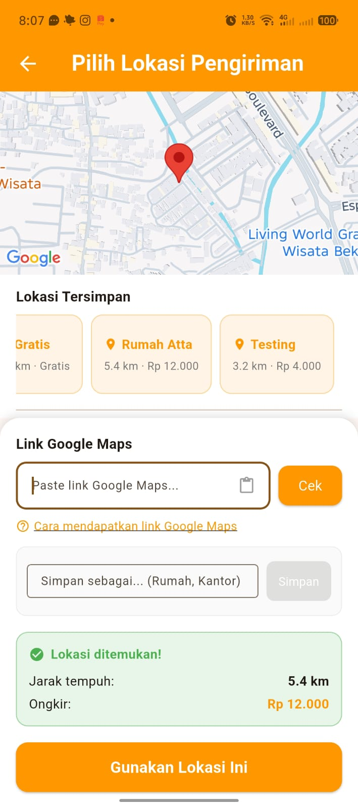
  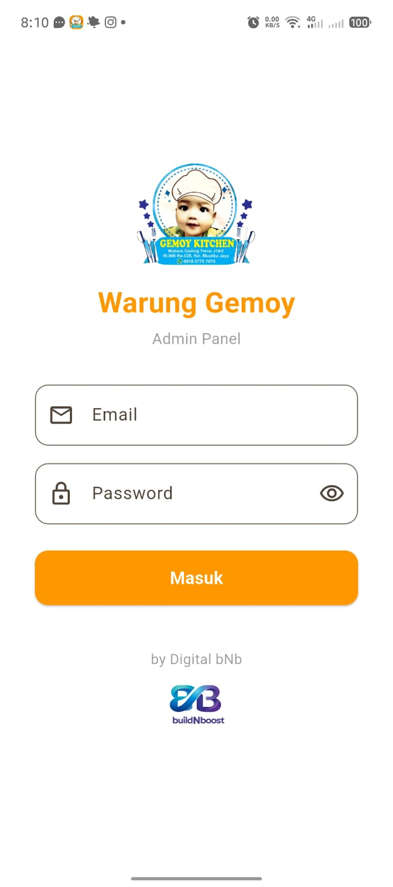
</p>
<p float="left">
  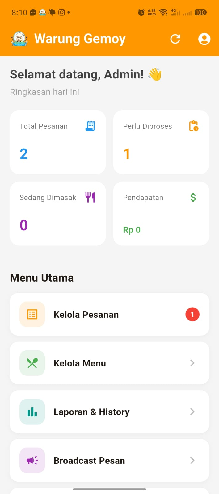
  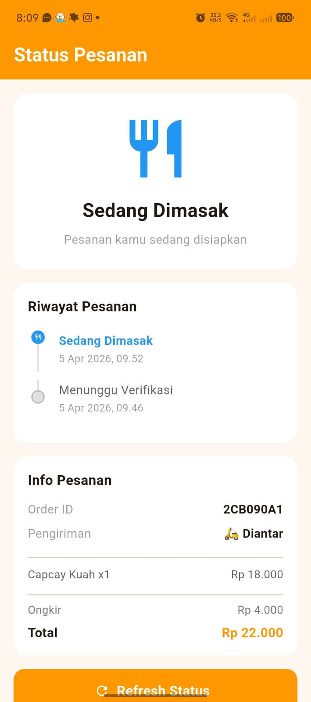
  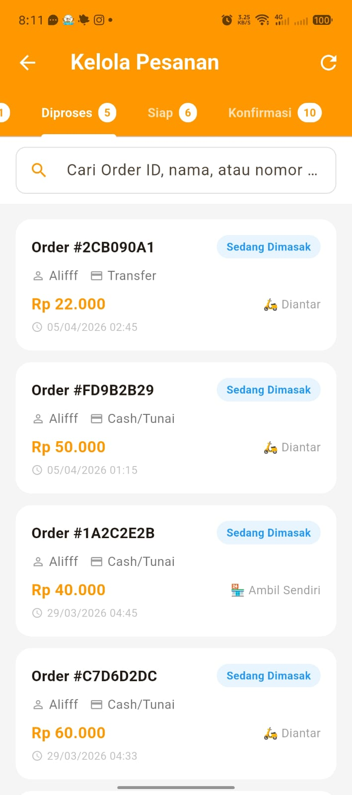
  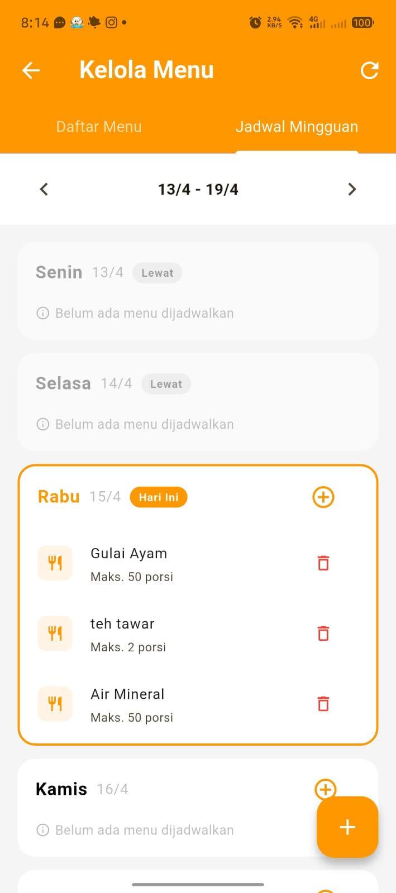
  
</p>
<p float="left">
  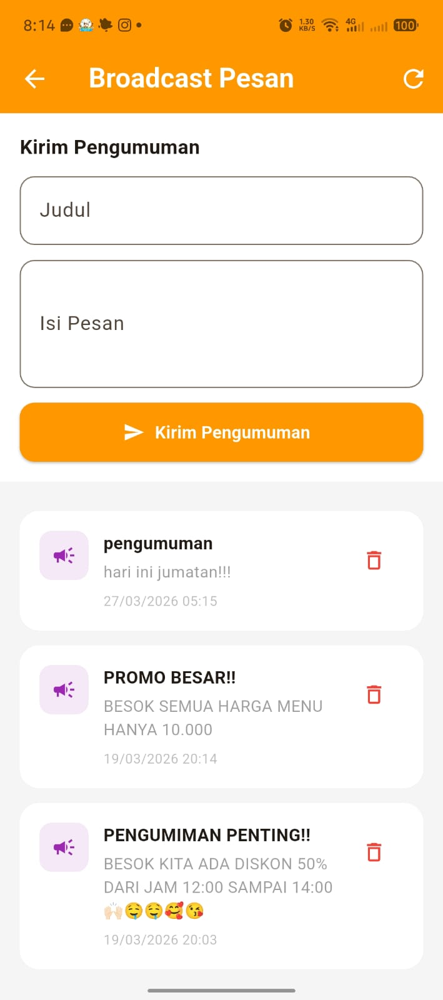
  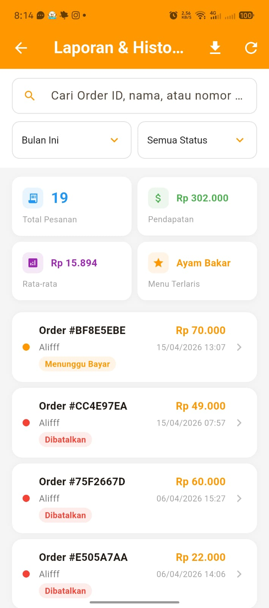
  
  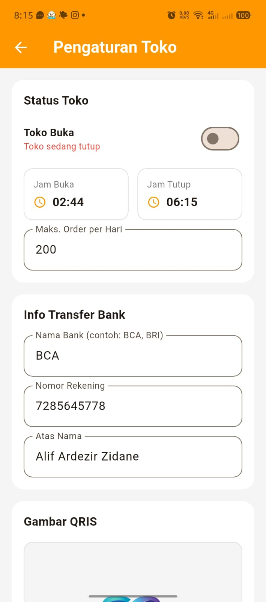
  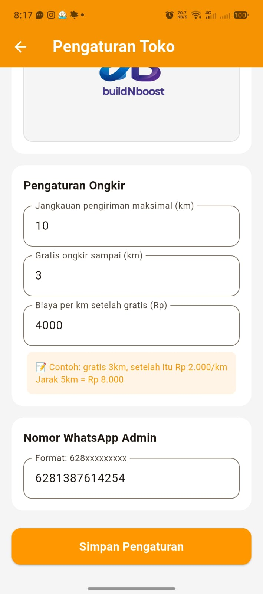
</p>
<p float="left">
  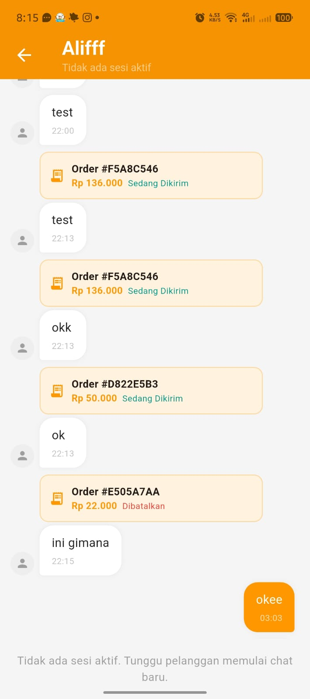
  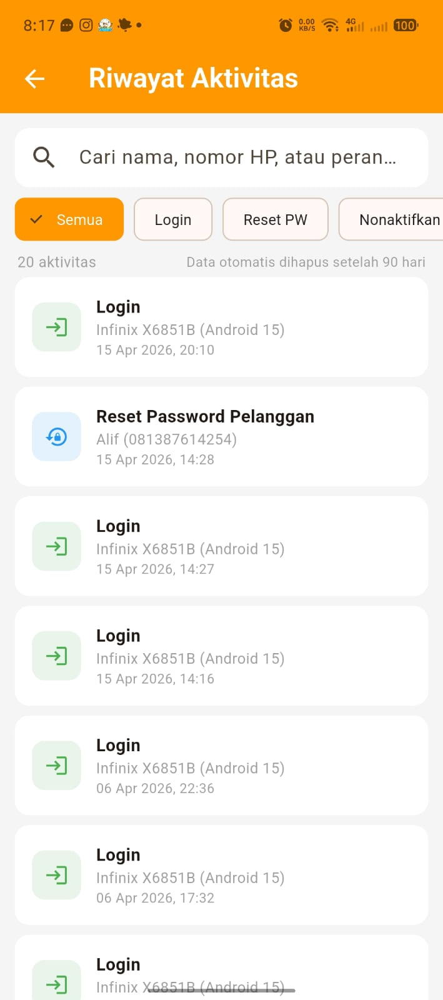
  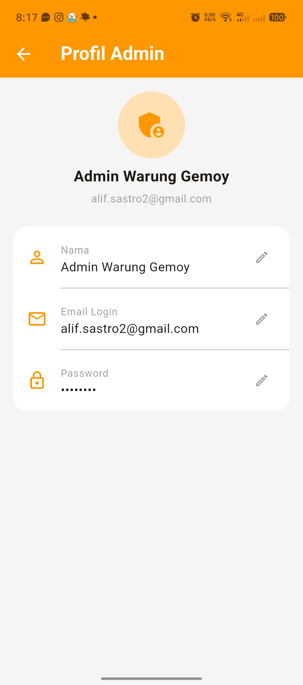
  
</p>

---

## Lisensi

Project ini dibuat sebagai portofolio pribadi. Tidak untuk dipublikasikan atau digunakan secara komersial tanpa izin.
